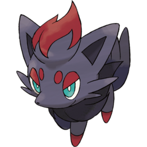
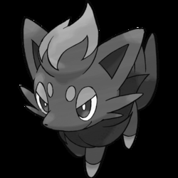
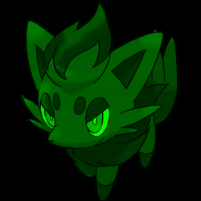
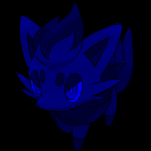
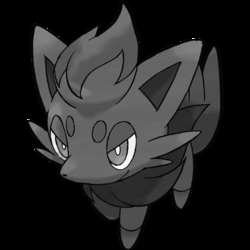
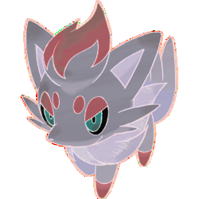
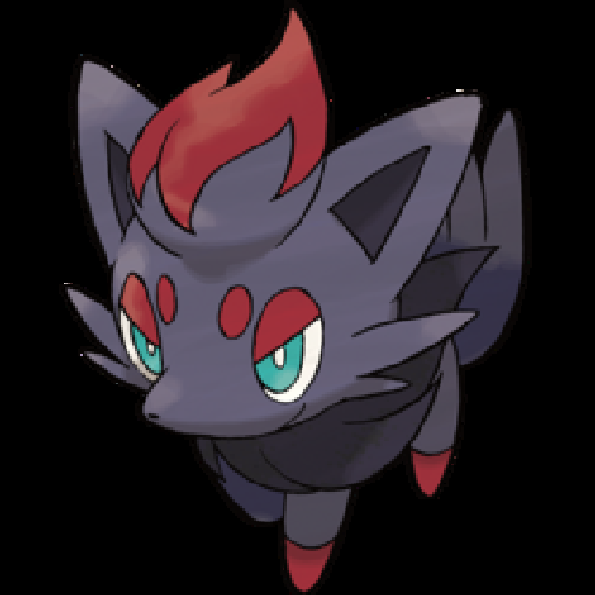

# Лабораторная работа №1

## Исходное изображение

## Выделение компонент R, G, B

## Конвертация в HSI

## Инвертация яркости

## Растяжение изображения в M раз (M == 2)

## Сжатие изображения в N раз (N == 3)

 
## Передискретизация в К = М/N раз (M == 2, N == 3) через растяжение и последующее сжатие

## Передискретизация в К раз за один проход
