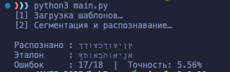
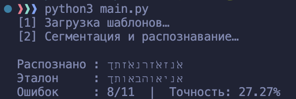

# Лабораторная работа №1

## Исходное изображение

## Выделение компонент R, G, B

## Конвертация в HSI

## Инвертация яркости

## Растяжение изображения в M раз (M == 2)

## Сжатие изображения в N раз (N == 3)

 
## Передискретизация в К = М/N раз (M == 2, N == 3) через растяжение и последующее сжатие

## Передискретизация в К раз за один проход

# Лаборатораня работа №2
### Бинаризация изображений методом Эйквила 

## Оригинальное изображение №1

## Полутоновое изображение 

## Биноризированное изображение

---

## Оригинальное изображение №2

## Полутоновое изображение 

## Биноризированное изображение

## Оригинальное изображение №3

## Полутоновое изображение 

## Биноризированное изображение

---

# Лабораторная работа №3
## Медианный фильтр 
## Разреженная маска — прямой крест

## Исходное изображение №1

## Фильтрованное изображение

## Разница 

## Исходное изображение №2

## Фильтрованное изображение

## Разница 

## Исходное изображение №3

## Фильтрованное изображение

## Разница

---

# Лабораторная работа №4
## Выделение контуров оператором Шарра

### Исходное изображение

### Полутоновое изображение

### Градиентные матрицы
#### Горизонтальный градиент (Gx)

#### Вертикальный градиент (Gy)

#### Результирующий градиент (G)

### Бинаризованный градиент
Порог бинаризации: 70

---

# Лабораторная работа №5
## Выделение признаков символов иврита

### Исходные данные
Алфавит: **ג ד ה ו ז ח ט י כ ך ל מ ם נ ן ס ע פ ף צ ץ ק ר ש ת ﭏ**

### 5.1. Генерация эталонных изображений
- **Метод генерации**: Скрипт `generator.py` создаёт бинарные изображения символов
- **Параметры**: 
  - Шрифт: Times New Roman
  - Кегль: 52
  - Размер изображения: 50×50 пикселей
- **Директория**: [lab5/images](lab5/images)  
  Пример сгенерированных символов:  
    

### 5.2. Предобработка изображений
- **Инвертирование цветов**: Скрипт `inversion.py` преобразует изображения в негатив (белый символ на чёрном фоне)
- **Цель**: Упрощение вычисления признаков за счёт единообразного представления
- **Результаты**: [lab5/inverse](lab5/inverse)

### 5.3. Извлечение признаков
Реализовано в `main.py`. Основные характеристики для каждого символа:

#### Геометрические признаки (CSV-колонки):
1. **Вес четвертей**:
   - `weight_I`, `weight_II`, `weight_III`, `weight_IV` - количество чёрных пикселей в каждой четверти
   - Относительные веса (`relative_*`) - нормировка на площадь четверти

2. **Центр масс**:
   - Абсолютные (`center_x`, `center_y`) и относительные координаты (`relative_center_*`)

3. **Моменты инерции**:
   - `inertia_x`, `inertia_y` - мера "разброса" пикселей относительно центра
   - Относительные значения (`relative_inertia_*`) - нормировка на размер изображения

#### Профили распределения:
- **Профиль X**: Сумма пикселей по вертикали  
  
- **Профиль Y**: Сумма пикселей по горизонтали  
  

Полный набор признаков для всех символов: [features.csv](lab5/features.csv)

### 5.4. Визуализация профилей
- **Директория с графиками**: [lab5/profiles](lab5/profiles)
  Пример для буквы "ה":  
   

  ---

# Лабораторная работа №6
## Сегментация текста

#### Выбранный алфавит: Иврит
#### גדהוזחטיכךלמםנןסעפףצץקרשתﭏ

### Скриншот:

### Результат сегментации символов:
#### Окаймляющие прямоугольники

#### Вырезанные символы

### Профили:

<h5>Сохранены в папке lab6/profiles</h5>

---

# Лабораторная работа №7:
## Распознавание символов на основе признаков

#### Выбранный алфавит: Иврит
#### גדהוזחטיכךלמםנןסעפףצץקרשתﭏ

### Пример 1
#### Исходное изображение (56 pt):

#### Для каждого обнаруженного символа в строке рассчитать меру близости со всеми символами выбранного алфавита:

#### Рeзультат:

### Пример 2.

#### Исходное изображение (56 pt):

#### После применения фильтрации:

#### Рeзультат:

### Пример 3.
#### Изображение с уменьшенным размером шрифта (16 pt):

#### Рeзультат:

### Пример 4.
#### Изображение c другим шрифтом (calibri):

#### Рeзультат:

---

# Лабораторная работа №8: 
## LBP-анализ и контрастирование

* Метод: LBP (Local Binary Patterns)
* Параметры: радиус 1, 8 соседей
* Признаки: Энтропия, Среднее значение LBP-гистограммы
* Метод преобразования яркости: Степенное преобразование (γ = 0.5)

---

## Изображение 1

### Оригинал

### Полутон

### Полутон после преобразования

### Гистограмма яркости ДО

### Гистограмма LBP ДО и ПОСЛЕ

### Признаки

| **Признак** | **До** | **После** |
|-------------|--------|-----------|
| **Энтропия**| 6.51   | 6.50      |
| **Среднее** | 885.32 | 885.32    |

---

## Изображение 2

### Оригинал

### Полутон (L)

### Полутон после преобразования

### Гистограмма яркости ДО

### Гистограмма LBP ДО и ПОСЛЕ

### Признаки

| **Признак** | **До** | **После** |
|-------------|--------|-----------|
| **Энтропия**| 3.30   | 3.21      |
| **Среднее** | 240.25 | 240.25    |

---

## Выводы

Метод LBP позволяет количественно оценить локальную текстуру изображения. После степенного преобразования яркости (γ = 0.5) значения энтропии и среднего по LBP-гистограмме изменяются незначительно, что говорит о сохранении текстурных особенностей при усилении контраста. Гистограммы LBP до и после преобразования практически совпадают, что подтверждает инвариантность LBP к монотонным преобразованиям яркости.

---

# Лабораторная работа 9. 
## Анализ шума

Работа выполнялась для записи игры на пианино. Запись имела заметный фоновый шум. Построена спектрограмма, проведено устранение шума с помощью фильтра Винера и фильтра нижних частот (lowpass).

## Спектрограмма исходного звука

## Спектрограмма после фильтра Винера

## Спектрограмма после фильтра прохода lowpass

В спектрограммах видно, что после Wiener-фильтра уровень фонового шума снизился, но сохранились резкие переходы сигнала. Low-pass фильтр подчистил высокочастотный шум.

## Выводы

Wiener-фильтр хорошо подавляет стационарный шум, но не удаляет узкополосные «помехи» и может искажать фазу.

Низкочастотный фильтр эффективно отсекает высокочастотный шум, оставляя основной диапазон музыкального инструмента, однако снижает детализацию.

---

# Лабораторная работа №10. Обработка голоса

Результаты

| Файл | Мин/Макс, Гц  | f₀ (медиана), Гц | № обертонов | Форманты, Гц           |
|------|---------------|------------------|-------------|------------------------|
| i    | 0.0 … 7007.8  | 160.6            | 2           | 2578.2, 4727.4, 7280.1 |
| dog  | 70.3 … 1265.6 | 87.3             | 2           | 613.4, 5497.6, 9011.3  |
| a    | 0.0 … 6000.0  | 137.2            | 1           | 827.6, 4798.5, 13786.2 |

## Спектрограмма И

## Спектрограмма Лай

## Спектрограмма А

